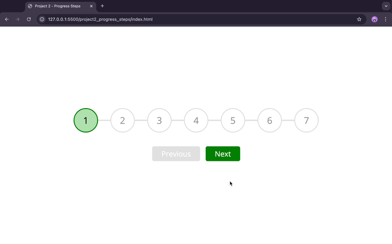

# 50-JS-Projects
50 JavaScript Projects to improve my HTML, CSS and JavaScript knowledge

 **Project 1 - Expanding Cards (Pittsburgh's Four Seasons)**
 [Code](./project1_expanding_cards/)

  

**Project 2 - Progress Steps (7 steps)**
 [Code](./project2_progress_steps/)

  

**Project 3 - Rotating Navigation**
 [Code](./project2_rotating_navigation/)

  

Source: [Udemy Course - 50 Projects In 50 Days - HTML, CSS & JavaScript by Brad Traversy and Florin Pop](https://www.udemy.com/share/103Pje3@xPMyQwqXeRYj9u1Z3y7kuOJu9PdGPFZAkPF1mxWRo29TqQSH3U9TS0jumb2WOSyp7A==/)